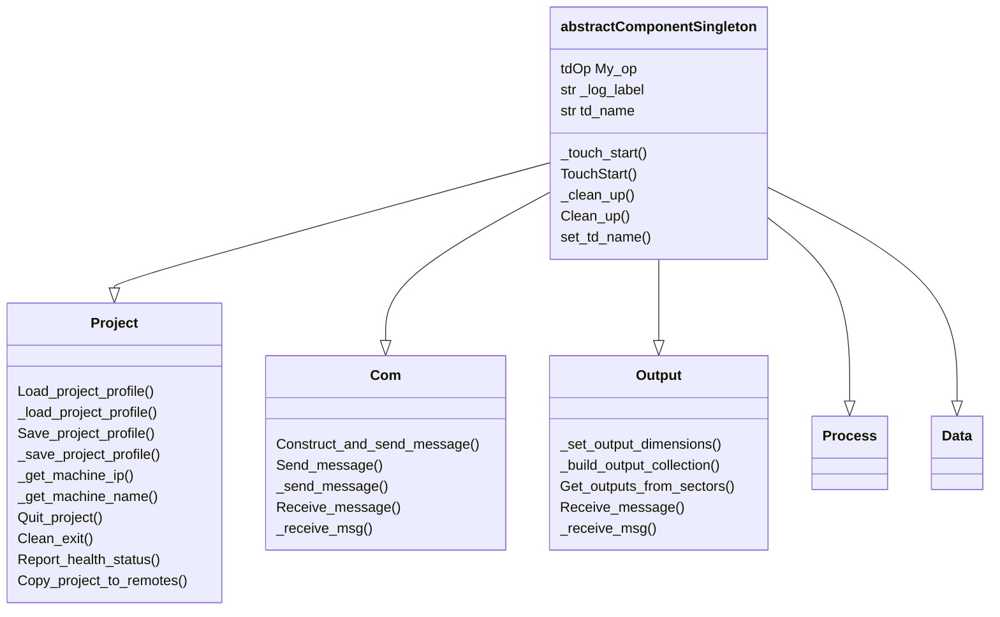

# Project Organization

## Root

## What's in your Network

## Standard Modules

| name | contents |
|--- | --- |
| `base_icon_ui`        |
| `local`               | 
| `base_project`        |
| `base_prod_tools`     |
| `base_dev_tools`      |
| `iparSettings`        |
| `base_com`            | 
| `base_ext_manager`    |
| `base_process`        | 
| `base_data`           | 
| `container_output`    |




<details>

<summary>Scaffold Structure</summary>

```
base_scaffold
    ├── base_icon_ui
    ├── local
    │    └── modules
    │        └── SudoMagic
    │
    ├── base_prod_tools
    ├── base_dev_tools
    ├── base_shader_lib
    │
    └── base_project
        ├── base_icon
        ├── base_startup
        ├── iparSettings
        ├── base_com
        ├── container_output
        ├── base_process
        ├── base_data
        └── local
            └── modules 
                ├── lookup
                ├── project
                ├── com
                ├── process
                ├── output
                └── data
```
</details>

## Links to Derivative's official docs


<!-- links -->