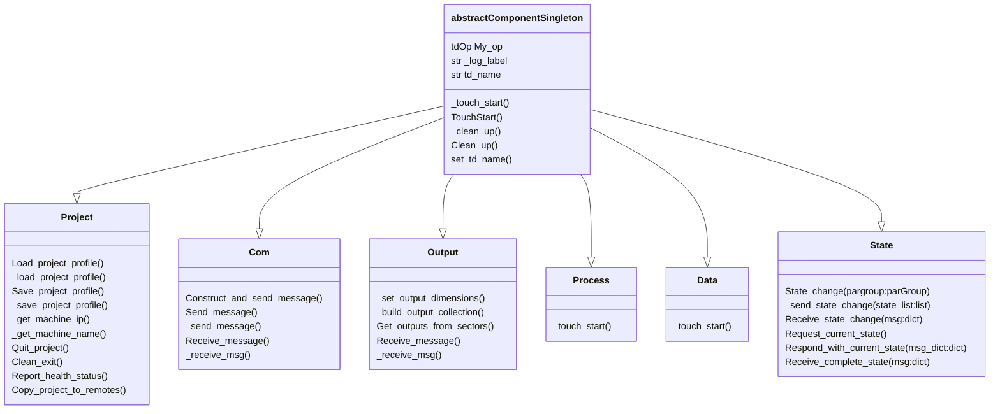

# Project Organization

## `/base_scaffold`


SudoMagic's standard project structure is built on top of a paradigm that has two layers of consistent components. SudoMagic's project beings with a `base COMP` called `base_scaffold` that acts as the root of any of our projects. This layer of the project contains a the following components:

### `base_shaderlib`
Shader Lib acts as a reusable shader library that should be accessible across all SudoMagic projects. Any given project might have variable elements, but the shader library should be accessible regardless, and with a shortest possible import path as possible. This allows for concise import statements that might be used in any shaders in the project. A universal shader library that's housed in the root of all projects also means that components developed in other environments can be easily ported to other SudoMagic projects. 

### `local`
Local's primary purpose in this layer of the project is to house modules on demand for TouchDesigner. `local/modules` houses our reusable SudoMagic Python libraries. The contents of `local/modules` is intended to be abstractly reusable across all projects.

### `base_project`
Project holds all of the elements that make up a given project. This is the portion of a project that is described by consistent formula of base components, but is also expected to different from project to project.

### `cloudPalette`
cloudPalette holds a component use intention is to create fast access to martials from the web. Your cloud palette is the DropBox of TouchDesigner components and snippets. These elements are not natively housed by the TouchDesigner network, but are instead loaded on demand from the cloud.

### `base_dev_tools`
Dev Tools houses the mission critical development components used across all SudoMagic projects. This includes tools like our TOX saving component, logging, performance profiling, and the like.


## `/base_scaffold/base_project`


A typical SudoMagic project contains the following persistent elements:

|Component | Description |
|---|---|
|`base_startup` | This component holds all of the start-up scripting and behavior for the project. Inside of this component you'll find few actual operators, and the addition of a `base COMP` acts primarily as a clean organization mechanic. | 
|`iparSettings` | We use internal parameters as our primary mechanic for collecting all fo the controls for a given project. This component acts as a single source of truth for all project settings. This creates a single operator that holds all parameters - making it easy to both save all settings to file, and load all settings from file quickly and centrally. | 
|`base_com` | COM, short for Communication, is the anchor for all network and communication traffic for a given project. This hub for communication acts as our anchor of all IO - making it simple to both make and receive calls. This also acts as the hub for where information is streamed from, or to for multi-machine projects. | 
|`container_output` | Output is the only Container component in the network - this component is linked to the standard Window COMP in the root of the TouchDesigner network, and contains any elements that will be rendered or displayed for the project. |
|`base_icon` | This has no functional impact on the project, but houses the icon that's used for the project. |
|`local` | Like `local` in `/base_scaffold` this holds any pure Python libraries that might be used for this specific project. Additionally, this component holds all of the extension code that will be used for extensions in the project. Extensions are centralized in part to allow for code completion across modules |
|`base_process` | Process servers as a component to house any data processing specific to the project that needs to be accessible across components.  |
|`base_data` | Data acts as a component to house all data for the project. This central point of access holds pieces like models, configuration schemas, and the like. |


# Class Diagram
Below is a diagram representation of the primitives that make up base class elements that can be extended and modified in each project.




# Summary of Network Topology
<details>
<summary>Scaffold Structure</summary>

```
base_scaffold
    ├── base_icon_ui
    ├── local
    │    └── modules
    │        └── SudoMagic
    │
    ├── base_prod_tools
    ├── base_dev_tools
    ├── base_shader_lib
    │
    └── base_project
        ├── base_icon
        ├── base_startup
        ├── iparSettings
        ├── base_com
        ├── container_output
        ├── base_process
        ├── base_data
        └── local
            └── modules 
                ├── lookup
                ├── project
                ├── com
                ├── process
                ├── output
                └── data
```
</details>

## Links to Derivative's official docs
[Base COMP]  
[Container COMP]

<!-- links -->

[Base COMP]: https://derivative.ca/UserGuide/Base_COMP
[Container COMP]:https://derivative.ca/UserGuide/Container_COMP