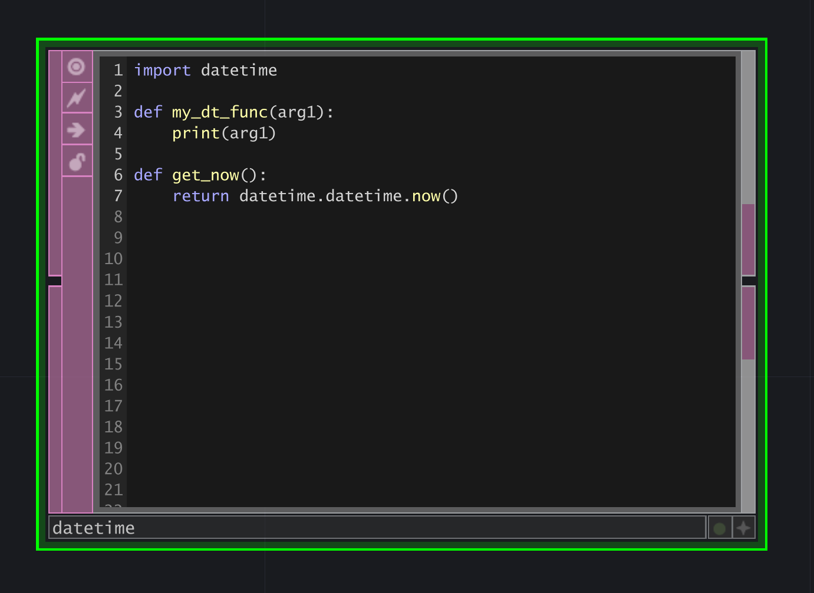
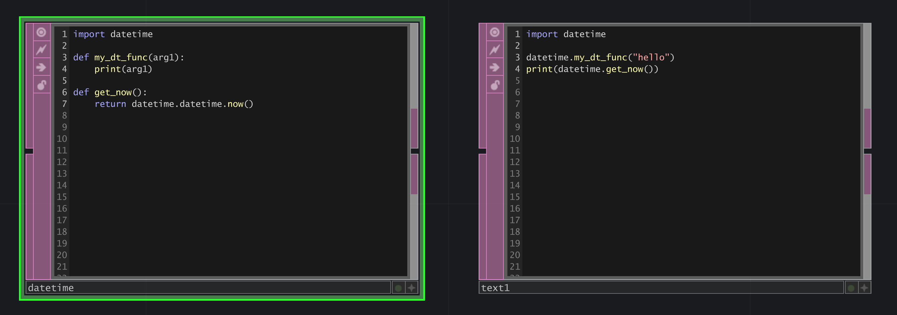
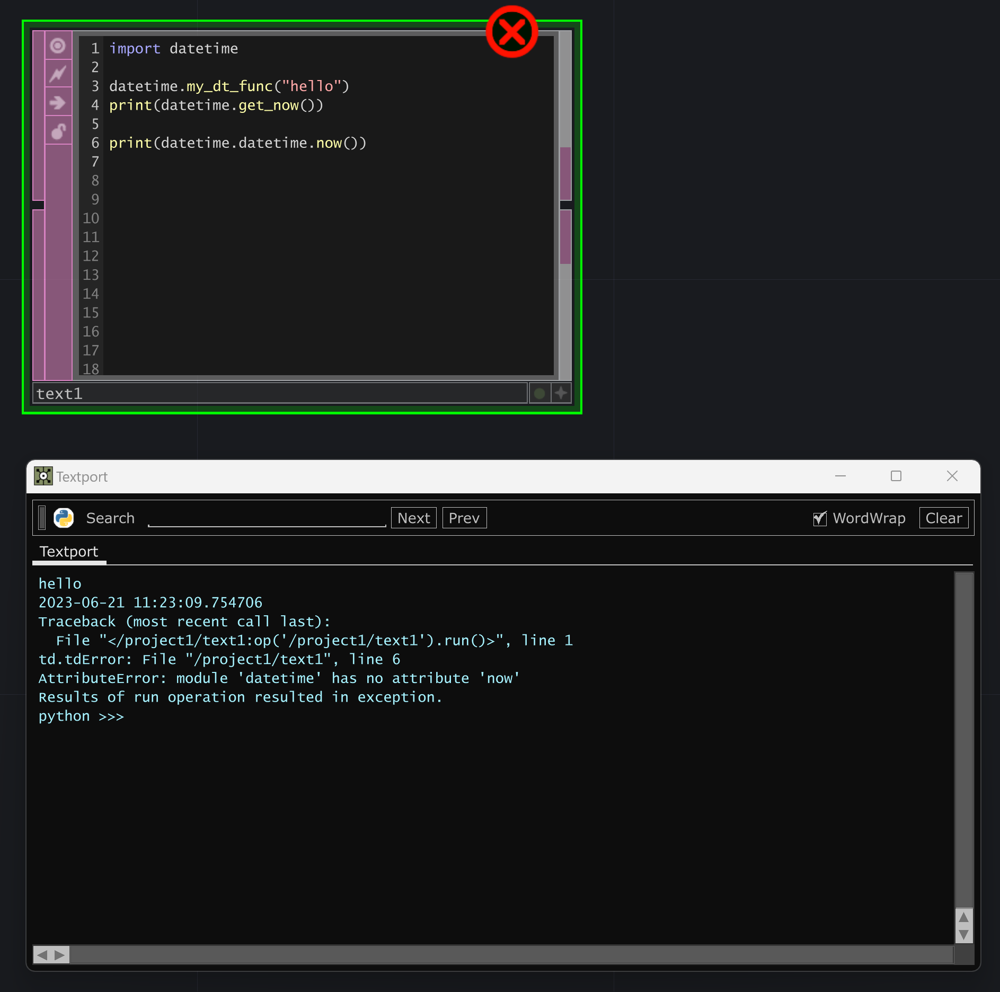

# Modules

Python in TouchDesigner shares many of the characteristics of a pure Python development experience, but also has some distinct differences. Inside of TouchDesigner Text DATs behave as though they are text files. This allows us the flexability of writing generic Python functions in one DAT, and then calling that function in another - for example with a CHOP Execute DAT. The mechanics of this are defined in the [MOD Class] wiki page, and cover three different ways you might import modules whose code is inside of DATs. 

This does, however, make for some interesting challenges and considerations. Specifically, committing to a defined paradigm for your namespace is critical when importing modules from Text DATs.

## Namespace Collisions

Consider the following scenario - in your project you want write a wrapper for the python `datetime` library. It's not uncommon to want to modify standard libraries so they are a better fit for the TouchDesigner workflow, and writing a wrapper around a library like `datetime` is something you might do. Feeling clever, you decide to change the name of your Text DAT to `datetime` - since it is your new datetime library. 

What's not to love about this? Next you want to call your new functions from another DAT. You add another DAT to your network and `import datetime` and call the functions you've just written.

At this point everything is coming up roses[^1]. There is, however, a catch to this approach - what happens if we try to access the pure Python `datetime` library from our `text1` DAT?

Errors abound. We've now created a complicated namespace - we are both importing the standard Python library called `datetime` and naming a Text DAT `datetime` which we are importing in the context of TouchDesigner as `datetime`. That means that only in our TextDAT version of `datetime` can we access any of the other functions in this library - which is deeply confusing. Said another way, we've overridden the standard library with our own module and created a namespace mess. For this reason, it's worth adopting a naming schema that helps ensure that these types of collisions are less likely to occur. 

Generally speaking, we append `MOD` to the end of any Text DAT that's treated as a module on demand. In our case that would mean naming our `datetime` wrapper `datetimeMOD`.

## When to use Modules
The use of the `mod` class, and the ability to import Text DATs as modules on demand started with some of the earliest implementation of Python in TouchDesigner. This opened up a number of different avenues for working with Python, and also created spaces to define reusable code in Text DATs that could be used by many different execute Ops. This can be hugely beneficial with respect to maintaining a library of code that's used multiple places. That's a hugely powerful idea, especially in TouchDesigner, but it does have some limitations. One in particular being that it's difficult to maintain a persistent object or variable between executions. 

Any given Text DAT has an independent scope - which means that the `my_int` of `text1` isn't easily accessed by `text2`. It is possible to declare a variable globally from within a DAT, but that's often messier than it might seem - when using global variables in Python the opportunity for namespace collisions is very high, especially when working in an environment like TouchDesigner. 

:::danger SudoMagic Practice

Our general practice is to avoid using global Python variables in any project code. 

::: 

## Links to Derivative's official docs
* [MOD Class]
* [Python Classes and Modules]

[^1]: For those unfamiliar, Ethel Merman's performance of [Everything's Coming Up Roses] once was the bee's knees.

<!-- links -->
[MOD Class]:https://docs.derivative.ca/MOD_Class
[Python Classes and Modules]:https://derivative.ca/UserGuide/Python_Classes_and_Modules
[Everything's Coming Up Roses]:https://www.youtube.com/watch?v=s62MrU8mHx4&ab_channel=dougster2810