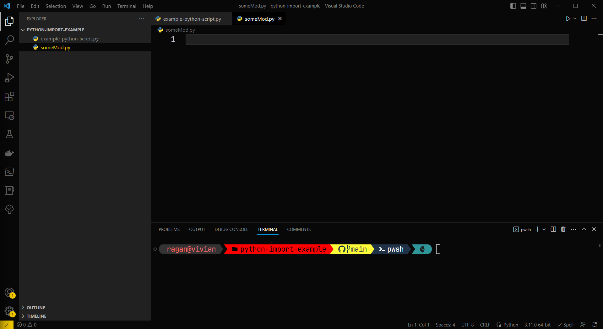
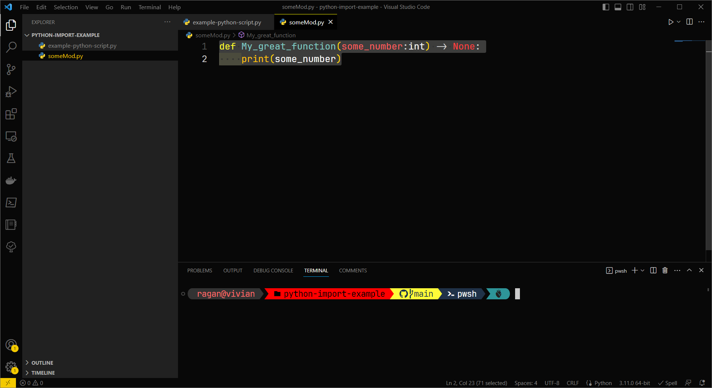
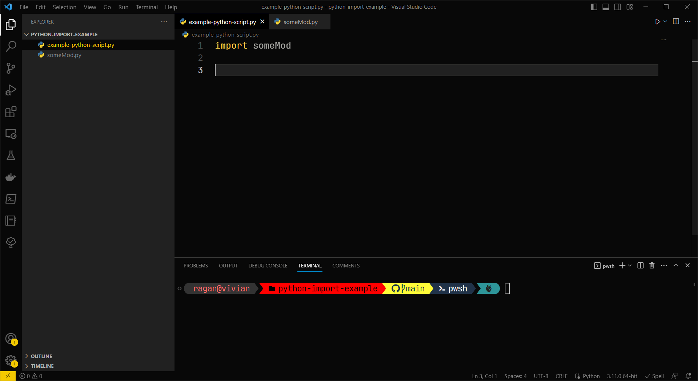
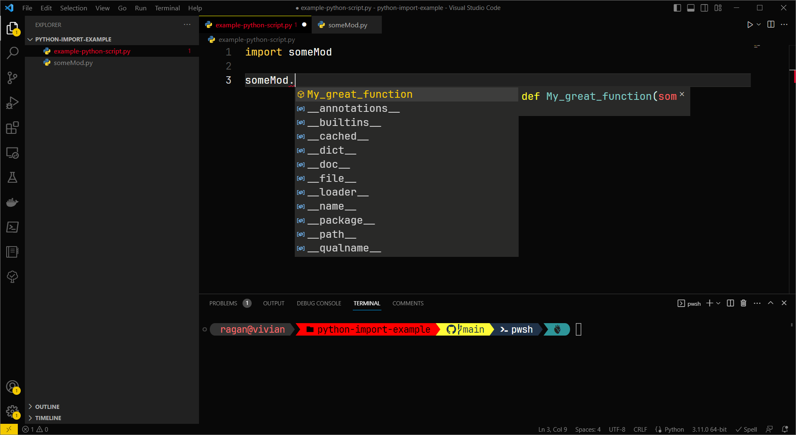
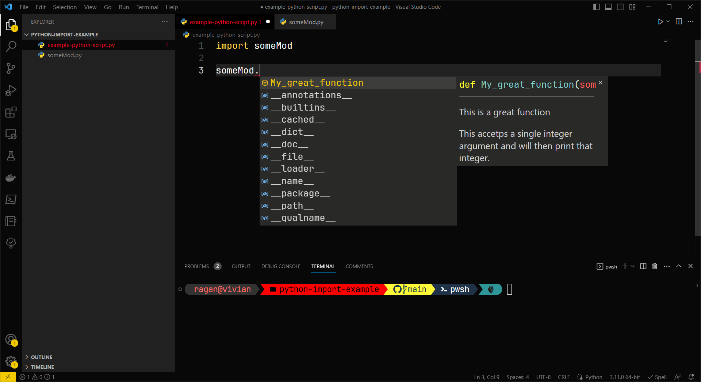
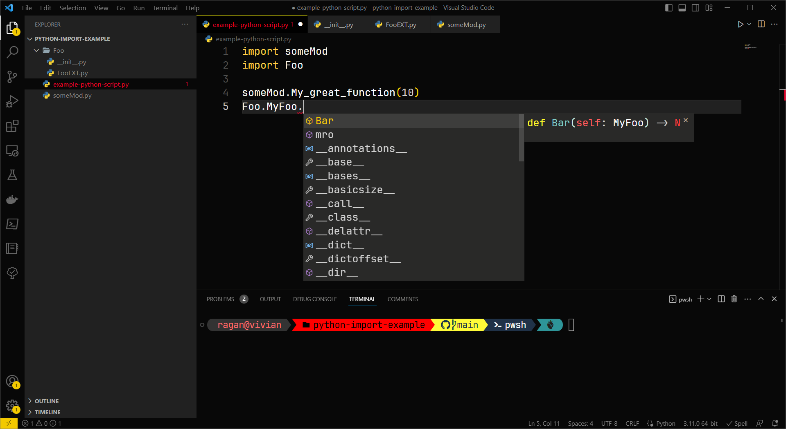
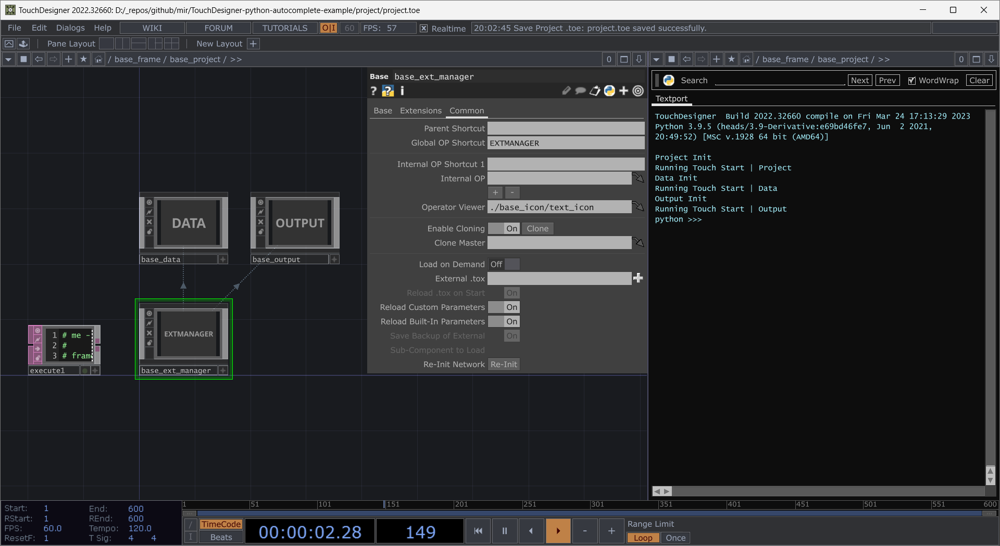
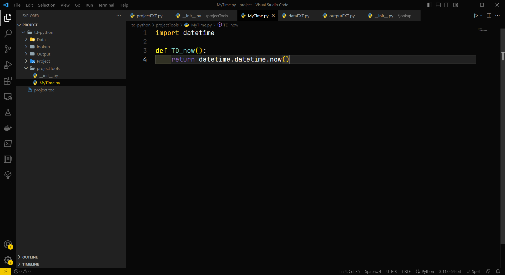

# Auto-Complete

## Your Code Editor and Python
This short diversion is for TouchDesigner devs who don't have a strong Python background. The way we use Python in TouchDesigner is a little different than the development of a pure Python App. The description that is going to follow is a bit of a simplification of what's actually happening in exchange for brevity. If you're interested, it's worth diving into the complete description of the [Python import system].

It's worth taking a moment to revisit these ideas, as having a deeper understanding of how your code editor understands and works with Python is going to impact our ability to have an autocomplete system in place. Our goal, in this exercise, is for our code editor to autocomplete the methods we author in our extensions and modules. This significantly increases our development speed, and reduces the opportunity for errors - but it does stand on understanding some of the deeper technical elements that Python stands on top of. 

For all of these examples and discussion we're working with [Visual Studio Code] as a code editor.


## Importing - back to the basics
To start, we need to first visit some basics of the Python paradigm. 

### what is `import`

The import keyword is used to invoke the python import system. Broadly speaking, in many languages code is written in smaller modules or libraries that are then included in larger projects. This organizes code into smaller chunks that are both reusable and more easily maintained (developing smaller libraries that allow parallel development or management is sometimes referred to as "[orthogonal](https://en.wikipedia.org/wiki/Orthogonality_(programming))" ).

The `import` keyword tells Python that there’s a set of functions outside of the default python tool set that are going to be accessed in any given module or library. As a best practice, import statements typically happen at the top of a module, and are outside of any functions so that their scope (your ability to use them) allows them to be used by any function in that module.

For example - this syntax is also completely functional:

```python
def UpdateDateTimeBuffer( datetime_buffer ):
    import datetime
    datetime_buffer.clear()
    datetime_object = datetime.datetime.now().strftime("%Y-%m-%d %H:%M:%S")
    datetime_buffer.write(datetime_object)
    return

def FetchDateAndTime():
    import datetime	
    return datetime.datetime.now().strftime("%Y-%m-%d %H:%M:%S")
```

The above is just redundant - if we only import `dateteime` in the local scope of function, no other function can use it, and we subsequently need to re-import in every function. This is why you typically see this instead:

```python
import datetime

def UpdateDateTimeBuffer( datetime_buffer ):
    datetime_buffer.clear()
    datetime_object = datetime.datetime.now().strftime("%Y-%m-%d %H:%M:%S")
    datetime_buffer.write(datetime_object)
    return

def FetchDateAndTime():
    return datetime.datetime.now().strftime("%Y-%m-%d %H:%M:%S")
```
The datetime library is available to all functions, which is typically what we want. As a final note, you can technically do this, but you shouldn't:

```python
def UpdateDateTimeBuffer( datetime_buffer ):
    datetime_buffer.clear()
    datetime_object = datetime.datetime.now().strftime("%Y-%m-%d %H:%M:%S")
    datetime_buffer.write(datetime_object)
    return

import datetime
def FetchDateAndTime():
    return datetime.datetime.now().strftime("%Y-%m-%d %H:%M:%S")
```

{: .warning}
This is considered bad form since it would be difficult for another developer to find that hidden import statement.

### Where does it come from?

To python, the import statement typically refers to a .py file or folder on your computer. datetime, for example can be found in your TouchDesigner installer folder, a typical installation location is: 

`C:\Program Files\Derivative\TouchDesigner.2021.15240\bin\Lib`


## Writing our own Module

We're going to do a pure Python review of importing. This assumes that you already have Python installed on your machine, and that you're comfortable with a code editor. It's okay if you're not there yet, just know this section may feel like it's leaving out smaller steps.

### Using a module example

Let's start by creating a directory called `python-import-example`. In here we're going to create two files:
* `example-python-script.py`
* `someMod.py`

Let's open this directory with our code editor, and also open up the console. You should have something like this:



Next let's add a simple function to our `someMod.py` file.

```python
def My_great_function(some_number:int) -> None:
    print(some_number)
```

Let's save that while we're at it, and we should now have something that looks like this in our code editor:



Next let's head back to our `example-python-script.py` file. At the top of this file we'll use the `import` keyword to the other code we just wrote as a module:

```python
import someMod
```


VS Code knows we're using Python - and as such, it will now offer to autocomplete code for us. We can see this in action if we start by typing `someMod.` - at this point we'll see a list of all the available functions that are in the module we've created:



This is great, in part because it keeps us in this module, and not going back to try and remember what we wrote. If we have doc strings in our other module those will also appear for us in the autocomplete (a quick note, I went back and added a doc string so we could see this in action).



### Using a class example

Let's keep moving forward from this idea, and instead of working with just a module, let's work with a class. In Object Oriented Programming, we think of class objects as templates for a specific instance of that item. When we think of a single instance of a class object, that design pattern is referred to a [Singleton]. Most of the extensions we write in TouchDesigner are Singletons, and when we're organizing our TouchDesigner networks into bigger components, like a `Communication` or `Data` base that severs our whole project, this is Singleton.

With that in mind let's look at how we we might write an import pattern for a Singleton. Let's start by adding a directory called `Foo` to our folder. Next we're going to add the following files in that directory:
* `__init__.py`
* `FooEXT.py`

Next let's add a little bit of code to the `FooEXT.py` file:

```python
class FooSingleton:
    
    def __init__(self):
        print('Ground control to Major Foo')
    
    def Bar(self):
        print('Sometimes you eat the bar, and sometimes the bar eats you')
```

In the `__init__.py` file we can now add the following:

```python
import FooEXT

MyFoo = FooEXT.FooSingleton
```
Here we import `FooEXT` and then create a new variable `MyFoo` that points to the `FooSingleton` class object in `FooEXT`.

That means back in our `example-python-script.py` file we can do the following:

```python
import someMod
import Foo

someMod.My_great_function(10)
Foo.MyFoo.Bar()
```

In VS Code, we now also get the autocomplete options from our Singleton:



## Back to TouchDesigner

In TouchDesigner this gets both complicated, and interesting. Where this becomes complicated is in relationship to the [MOD Class]. The contents of any DAT can be treated as though they were a module. In TouchDesigner the `import` keyword operates on DATs, the way `import` works on files in pure Python. We can take advantage of both this so that we can both use extensions as you might in TouchDesigner, and get the advantages of autocomplete in VS Code. 

To get started, we have to make a few compromises. For this to work best, we need to first centralize where our extensions are going to live both in TouchDesigner and in our project's directory structure. We also have to commit to using external files for our extensions. 

### An Extension Manager

In TouchDesigner we're going to keep all of our extensions in an operator called `base_ext_manager`:



In our extension manager we'll have all of our extensions in DATs whose names match their file names in python:


In VS Code we'll see that we've created a new directory for each extension, and in that directory is an `__init__.py` file and the extension file. The name space is important here, so take a moment to see the pattern we've created. 

Finally, we create one extra module called `lookup` which is going to act as the bridge for both TouchDesigner and VS Code. Here we're going to perform a little magic trick that using type hinting (our ability to tell Python that an object is supposed to match an known object).

Let's look at what's in `lookup`:

```python
from __future__ import annotations

try: 
    import Project
    import Data
    import Output

except:
    pass

PROJECT:Project.Project = op.PROJECT
DATA:Data.Data = op.DATA
OUTPUT:Output.Output = op.OUTPUT
```
`annotations` let's us take advantage of a try and accept block that's only for VS Code. This let's VS Code interpret our import statement in order to offer us code completion. This let's us tell VS Code that our variable `PROJECT` in code is actually a `Project.Project` object (which is our extension Singleton), while TouchDesigner will see this variable as pointing to the global op shortcut `op.PROJECT`. In this way, the variable `PROJECT` to TouchDesigner is the operator (which has a promoted extension), and to VS Code `PROJECT` is a proper Python Object. 

## The Magic of Local Modules
This is all great for Extensions, but there is one other feature of the [MOD Class] that we can take advantage of in TouchDesigner. The MOD Class allows the use of two nested base COMPs `local/modules` to hold the a collection of Python modules that are the first location TouchDesigner will search during import. We can use this to our advantage when building reusable libraries that we want to keep out of extensions.

Let's say, for example, that we want to have access to the `datetime` module in our extensions. It would be redundant to import this into each extension. Instead we might create a collection of tools that follow a functional paradigm that we can then use from a single location. This reduces the likelihood that we'll repeat ourselves, and will help us keep a cleaner code base.

To do this let's first create a new directory in our `td-python` directory called `projectTools`. In this directory we'll create two files:
* `__init__.py`
* `MyTime.py`

In the `__init__.py` file let's import our `MyTime.py` file:

```python
import MyTime
```

In `MyTime` we can add a simple function for now:

```python
import datetime

def TD_now():
    return datetime.datetime.now()
```
You should have something that looks like this:



in TouchDesigner let's start by creating our base ops, let's next navigate into `local/modules` and add two text DATs. 


We can now go back to our `Project` extension and import `projectTools`:

```python
import lookup
import projectTools

class Project:

    def __init__(self, owner_op):
        self.Owner_op = owner_op
        print(f'Project Init at | {projectTools.MyTime.TD_now()}')

    def Touch_start(self):
        print('Running Touch Start | Project')
        lookup.DATA.Touch_start()
        lookup.OUTPUT.Touch_start()

    def Promoted_project_method(self):
        ...
```

## It's okay to be confused

This is a confusing concept - in part because of how extensions and modules work in TouchDesigner. The benefits here, however, are that we can now have a more seamless development workflow in VS Code. It also means that when collaborating with others, you can treat extensions  and modules much more like proper Python.

### Sample Repo

If you're still scratching your head, that's okay. Download this repo to see how these concepts work in action.

[MIR Sample Autocomplete]

## Links to Derivative's official docs

<!-- links -->
[MOD Class]:https://docs.derivative.ca/MOD_Class
[MIR Sample Autocomplete]:https://github.com/mir-lab/TouchDesigner-python-autocomplete-example
[Visual Studio Code]:https://code.visualstudio.com/
[Python import system]:https://docs.python.org/3/reference/import.html
[Singleton]:https://en.wikipedia.org/wiki/Singleton_pattern